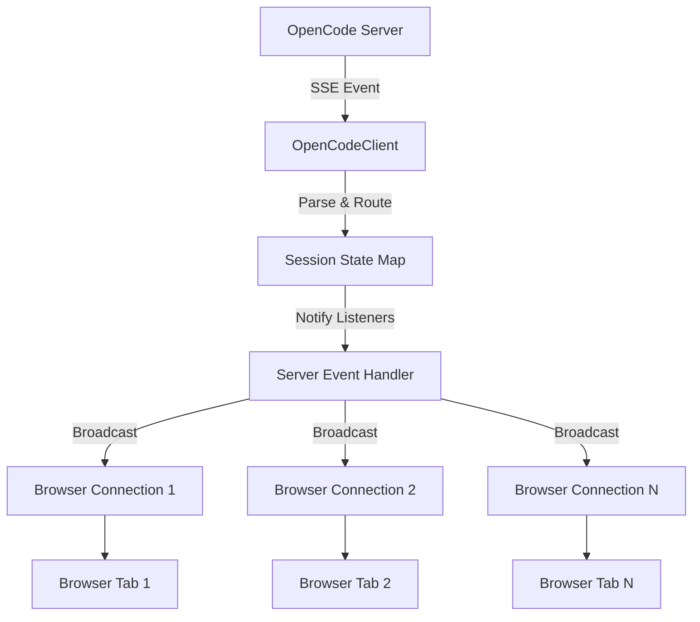

# OpenCode Chat SSE Architecture Analysis

## Executive Summary

This analysis examines the Server-Sent Events (SSE) implementation in OpenCode Chat, focusing on session management, concurrency patterns, and architectural constraints. The system uses a two-tier SSE architecture: a single persistent connection from the Bun server to OpenCode, and per-session connections from browsers to the Bun server.

**Key Findings:**
- ❌ **Critical**: Event loss possible during session switching 
- ❌ **High Risk**: No session exclusivity enforcement
- ⚠️ **Medium Risk**: Permission events can be missed during connection transitions
- ⚠️ **Medium Risk**: Race conditions in rapid session switching
- ✅ **Supported**: Multiple concurrent sessions in different tabs
- ✅ **Supported**: Multiple browsers on same session

## 1. Current SSE Architecture

### 1.1 Connection Topology

```
OpenCode Server ──SSE──→ Bun Server ──SSE──→ Multiple Browsers
     (Single)              (Multiplexer)        (Per-session)
```

**OpenCode → Bun Server Connection:**
- **File**: `/Users/tito/code/opencode-chat/src/opencode-client.ts`
- **Endpoint**: `${OPENCODE_URL}/event` (line 44)
- **Connection Type**: Single persistent SSE connection for ALL sessions
- **Multiplexing**: Events routed by `sessionId` extracted from event properties (lines 232-237)
- **Reconnection**: Exponential backoff with max 30s delay (lines 123-124)

**Bun Server → Browser Connection:**
- **File**: `/Users/tito/code/opencode-chat/src/server.ts`
- **Endpoint**: `/stream?sessionId=${sessionId}` (line 292)
- **Connection Type**: One SSE connection per browser session
- **State Broadcasting**: Server maintains `browserConnections` Map (lines 75-79) and broadcasts updates to all subscribers of a session (lines 82-95)

### 1.2 Event Flow Architecture



## 2. Session Exclusivity Analysis

### 2.1 Current State: No Session Exclusivity

**Code Evidence:**
- `browserConnections` Map allows multiple controllers per sessionId (line 308, server.ts)
- No mutual exclusion or locking mechanisms found
- OpenCode server has no visible session exclusivity enforcement

```typescript
// server.ts line 308 - Multiple connections allowed
browserConnections.get(sessionId)!.add(controller);
```

**Implications:**
- ✅ Multiple browsers can collaborate on same session
- ❌ Conflicting actions possible (e.g., simultaneous tool executions)
- ❌ No coordination between multiple users

### 2.2 Concurrent Message Handling

When the same session receives messages from multiple clients:
- Each message creates a separate request to OpenCode server
- OpenCode processes messages sequentially per session
- No client-side coordination or queueing

**Risk Scenarios:**
1. **Simultaneous Tool Calls**: Two users trigger conflicting file operations
2. **Permission Conflicts**: Multiple users respond to same permission simultaneously
3. **State Inconsistency**: Rapid actions from different clients creating race conditions

## 3. SSE Connection Management During Session Switching

### 3.1 Browser-Side Session Switch Process

**File**: `/Users/tito/code/opencode-chat/src/components/Chat.tsx` (lines 157-159)

```typescript
// Connection cleanup and recreation
if (eventSourceRef.current) {
  eventSourceRef.current.close(); // ← Gap starts here
}

const eventSource = new EventSource(`/stream?sessionId=${sessionId}`); // ← Gap ends here
```

**Critical Gap**: Time window between connection close and new connection establishment where events can be lost.

### 3.2 Server-Side Connection Management

**File**: `/Users/tito/code/opencode-chat/src/server.ts` (lines 330-336)

```typescript
req.signal.addEventListener("abort", () => {
  clearInterval(keepalive);
  browserConnections.get(sessionId)?.delete(controller);
  if (browserConnections.get(sessionId)?.size === 0) {
    browserConnections.delete(sessionId);
  }
});
```

**Connection Lifecycle:**
1. ✅ Proper cleanup on disconnect
2. ✅ Automatic keepalive (30s interval)
3. ❌ No event buffering during reconnection
4. ❌ No replay mechanism for missed events

### 3.3 OpenCode Connection Stability

**Advantage**: Single persistent OpenCode → Bun connection means:
- ✅ No connection interruption during browser session switches
- ✅ Server maintains complete state across session switches
- ✅ Automatic reconnection preserves session data

## 4. Permission Event Reliability

### 4.1 Permission Flow Architecture

```
OpenCode → Bun (permission.updated) → Browser (SSE) → UI Permission Modal
                                   ↓
                        Session State (ephemeral)
```

**File**: `/Users/tito/code/opencode-chat/src/opencode-client.ts` (lines 194-201)

```typescript
else if (t === "permission.updated") {
  const perm: Permission = event.properties;
  if (!state.permissions.byId[perm.id]) {
    state.permissions.byId[perm.id] = perm;
    state.permissions.queue.push(perm.id);
    if (!state.permissions.activeId) state.permissions.activeId = perm.id;
    updated = true;
  }
}
```

### 4.2 Risk Analysis: Missing Permission Events

**Critical Risk Scenarios:**

1. **Session Switch Timing**:
   ```
   Permission Event Arrives → Browser Connection Closed → Event Lost
   ```

2. **Browser Connection Drop**:
   - Permission exists in server state
   - Browser loses connection temporarily
   - Permission not re-delivered on reconnection

3. **Race Condition**:
   ```
   User switches session → Permission arrives for old session → Not displayed
   ```

### 4.3 Recovery Mechanisms

**Current Recovery**: Limited bulk permission handling endpoint
- **File**: `/Users/tito/code/opencode-chat/src/server.ts` (lines 239-289)
- **Endpoint**: `/session/:sessionId/permissions/handle-all`
- **Purpose**: Handle ALL pending permissions with single action
- **Limitation**: All-or-nothing approach, no individual permission recovery

## 5. Concurrent Work Patterns

### 5.1 Supported Concurrent Patterns

| Pattern | Support | Risk Level | Notes |
|---------|---------|------------|--------|
| Multiple sessions, different tabs | ✅ Full | Low | Each session isolated |
| Multiple sessions, same browser | ✅ Full | Low | Independent SSE streams |
| Same session, multiple tabs | ✅ Full | **High** | No coordination |
| Same session, multiple browsers | ✅ Full | **High** | No user conflict resolution |
| Multiple users, same session | ✅ Technical | **Critical** | No access control |

### 5.2 Resource Implications

**Memory Usage**: 
- One SSE connection per browser tab
- State maintained for all active sessions in OpenCodeClient
- Browser connection tracking Map grows with concurrent users

**Connection Limits**:
- No enforced limits on connections per session
- No connection throttling or rate limiting
- Potential for connection exhaustion

### 5.3 State Synchronization Challenges

**Current State Sync**: Broadcast-based, no conflict resolution
- All browsers receive same state updates
- Last-write-wins for conflicting actions
- No operational transforms or merge strategies

## 6. Architecture Constraints and Critical Issues

### 6.1 Hard Constraints from OpenCode Server

1. **Single SSE Endpoint**: OpenCode provides only `/event` endpoint for all sessions
2. **Event-Based State**: No REST API for complete state reconstruction
3. **Session Lifecycle**: Sessions managed by OpenCode, not exposed through APIs
4. **Permission Ephemeral**: No persistent permission storage

### 6.2 Critical Race Conditions Identified

**Race Condition 1: Session Switch + Permission**
```
Timeline:
T1: User starts session switch
T2: Permission event arrives for old session  
T3: Browser closes old SSE connection
T4: Permission event lost
T5: New SSE connection established
Result: User never sees permission
```

**Race Condition 2: Rapid Session Switching**
```
Timeline:
T1: Switch to Session A
T2: Quickly switch to Session B  
T3: SSE connection for A still establishing
T4: State updates arrive for both sessions
T5: UI shows mixed state
Result: Corrupted session display
```

**Race Condition 3: Concurrent Tool Execution**
```
Timeline:
T1: User A starts file edit tool
T2: User B starts same file edit tool
T3: Both tools execute simultaneously  
T4: File corruption or unexpected results
Result: Data integrity issues
```

### 6.3 Data Loss Scenarios

1. **Connection Drop During Tool Execution**:
   - Tool starts running
   - Browser loses connection
   - Tool completes but results not displayed
   - User doesn't know operation finished

2. **Permission During Network Partition**:
   - Network interruption during permission request
   - Permission times out in OpenCode
   - User never gets chance to respond
   - Tool execution blocked indefinitely

3. **Session State Desynchronization**:
   - Multiple rapid actions during poor connectivity
   - Some state updates lost
   - Browser shows stale/incorrect session state

## 7. Recommendations

### 7.1 Immediate Critical Fixes

**1. Add Event Buffering During Session Switches**
```typescript
// Buffer events during session transitions
const eventBuffer: Event[] = [];
let isTransitioning = false;

// Before closing connection
isTransitioning = true;

// After establishing new connection  
isTransitioning = false;
eventBuffer.forEach(processEvent);
eventBuffer.length = 0;
```

**2. Implement Permission Persistence**
- Store permissions in browser localStorage during connection gaps
- Re-check permission state after reconnection
- Add permission recovery API endpoint

**3. Add Connection State Management**
```typescript
enum ConnectionState {
  CONNECTING,
  CONNECTED, 
  RECONNECTING,
  FAILED
}
```

### 7.2 Architectural Improvements

**1. Session-Aware Connection Management**
- Implement graceful session handoff
- Add state synchronization checkpoints  
- Buffer critical events during transitions

**2. Conflict Resolution Framework**
- Add optimistic concurrency control
- Implement last-writer-wins with conflict detection
- Add user presence indicators

**3. Enhanced Recovery Mechanisms**
- Periodic state reconciliation
- Event replay capability
- Idempotent operation design

### 7.3 Long-term Architectural Changes

**1. Consider WebSocket Upgrade**
- Bidirectional communication for better coordination
- Built-in heartbeat and reconnection
- Better support for real-time collaboration

**2. Add Session Locking Options**
- Optional exclusive session access
- Advisory locks for sensitive operations
- User presence and activity indicators  

**3. Implement Event Sourcing Pattern**
- Immutable event log
- Replay capability for state reconstruction
- Better debugging and audit trail

## 8. Testing Strategy

### 8.1 Critical Test Scenarios

1. **Rapid Session Switching Test**:
   - Switch sessions every 100ms for 30 seconds
   - Verify no state corruption or event loss
   - Check memory leaks in connection tracking

2. **Permission Reliability Test**:
   - Generate permissions during active session switching
   - Verify all permissions eventually reach user
   - Test recovery after network interruption

3. **Concurrent User Simulation**:
   - Multiple browsers on same session
   - Simultaneous tool executions
   - Verify data integrity and user experience

4. **Network Resilience Test**:
   - Simulate connection drops during critical operations
   - Test reconnection behavior
   - Verify state consistency after recovery

### 8.2 Monitoring Requirements

1. **Connection Health Metrics**:
   - Active SSE connections per session
   - Connection failure rates
   - Reconnection frequency

2. **Event Delivery Metrics**:
   - Event processing latency
   - Permission response times
   - Event loss detection

3. **State Consistency Metrics**:
   - State synchronization lag
   - Conflict resolution frequency
   - Data integrity validation

## 9. Conclusion

The current OpenCode Chat SSE architecture provides functional real-time communication but has significant reliability and consistency issues, particularly around session switching and concurrent usage. While the system supports multiple concurrent work patterns, the lack of coordination mechanisms creates substantial risks for data integrity and user experience.

**Priority Actions:**
1. **Critical**: Fix event loss during session switching
2. **High**: Add permission persistence and recovery  
3. **High**: Implement connection state management
4. **Medium**: Add conflict resolution for concurrent operations
5. **Medium**: Enhance monitoring and debugging capabilities

The architecture's strength lies in its simplicity and the persistent OpenCode connection, but improvements are essential for production reliability and multi-user scenarios.